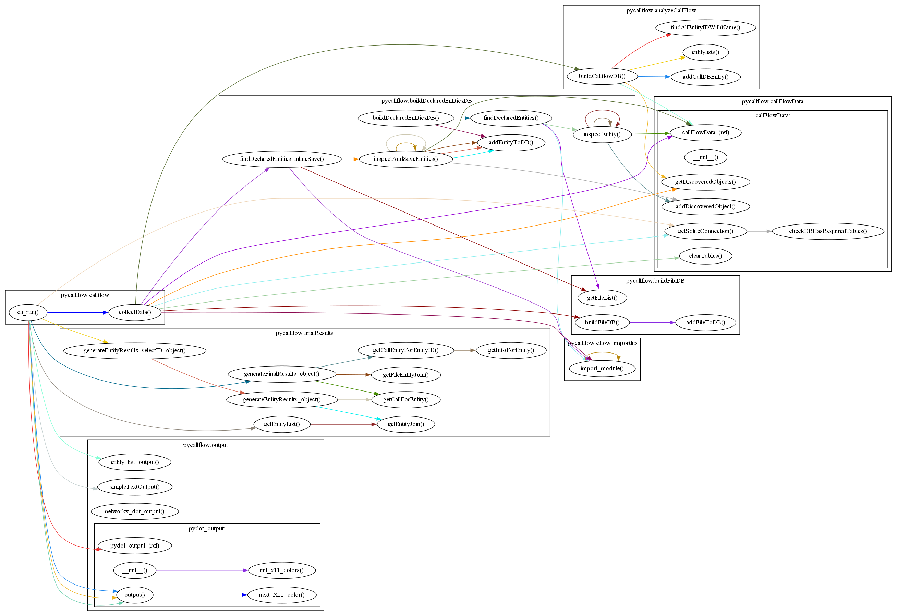

# pycallflow

[](https://pypi.org/project/pycallflow)
[](https://pypi.org/project/pycallflow)

-----
## WARNING
Do not use pycallflow to map hostile or potentially malicious python code.  Code may be executed as it is examined.


**Table of Contents**

- [Installation](#installation)
- [License](#license)

## What is Pycallflow

Pycallflow produces GraphViz-compatible output that visually shows the flow of calls within a module, package, or directory of python files like this:


I wrote it to help me get a grip on python projects that have accreted files and capability over time.  It was difficult to hand trace the call flows when their were problems and upgrades to be done.

There are limitations and some significant limitations.  Please see BLAH below

## What it does

Pycallflow recursively imports and analyzes the files in a module or directory to identify all of the declared entities (functions, methods, and classes).  It  maps the calls between these entities to produce a network graph which is then rendered in DOT language.

## Installation

```console
pip install pycallflow
```

## Usage

### Basics

Invoke with
```console
python -m pycallflow [target module]
```
To generate a DOT-language call flow diagram of every discovered entity.

If you have GraphViz installed you can pipe it:
```console
python -m pycallflow [target module] | dot -Tpng -ofilename.png
```
### Clean up

The diagrams can get quite busy, but there are three options that can limit some of the noise

#### suppress_recursive_calls

Entities that recurse on themselves will get loop indicators like this:

PIC HERE

```console
python -m pycallflow --suppress_recursive_calls [module]
```
Will result in the elimination of these loops:

PIC HERE

####


## License

`pycallflow` is distributed under the terms of the [MIT](https://spdx.org/licenses/MIT.html) license.
