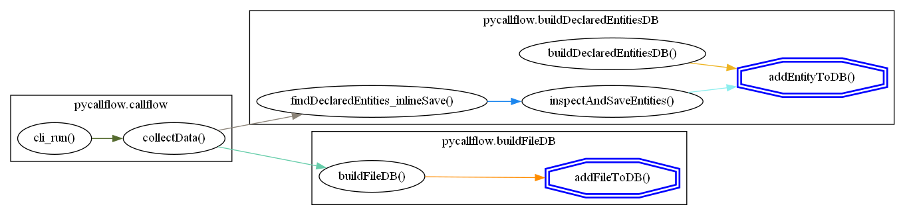

# pycallflow

[](https://pypi.org/project/pycallflow)
[](https://pypi.org/project/pycallflow)

-----
## WARNING
Do not use pycallflow to map hostile or potentially malicious python code.  Code may be executed as it is examined.

## What is Pycallflow

Pycallflow produces GraphViz-compatible output that visually shows the flow of calls within a module, package, or directory of python files like this:


I wrote it to help me get a grip on python projects that have accreted files and capability over time.  It was difficult to hand trace the call flows when there were problems and upgrades to be done.

There are limitations and some significant warnings.  Please see [Warnings](#warnings-and-limitations) below

## What it does

Pycallflow recursively imports and analyzes the files in a module or directory to identify all of the declared code entities (functions, methods, and classes).  It maps the calls between these entities to produce a network graph which is then rendered in DOT language.

## Installation

```console
pip install pycallflow
```

## Usage

### Basics

Invoke with
```console
python -m pycallflow [target]
```
To generate a DOT-language call flow diagram of every discovered entity.

If you have GraphViz installed you can pipe it:
```console
python -m pycallflow [target] | dot -Tpng -ofilename.png
```

### Flow Arrows (edges)

The colors of the edges do not mean anything.  I rotate through a list of contrasting colors in an attempt make it easier to trace the flow lines.  You can set the color with ```---edge_color``` if you want it fixed to a specifc color.

You may see dashed edges.  Dashed edges indicate the call or reference may be ambiguous.  This means there are multiple entities with the exact same name (i.e. two or more files or classes contain a function with the same name).  This is very common with subclasses that override parent methods.  Though Python always seems to know which one you mean, it's a little harder to figure out from the outside.  Improving this is a main goal for the future.

### Clean up

The diagrams can get quite busy, but there are three options that can limit some of the noise

#### --suppress_recursive_calls

Entities that recurse on themselves will get loop indicators like this:


```console
python -m pycallflow --suppress_recursive_calls [target]
```
Will result in the elimination of these loops:


#### --combine_calls

Entities may call the same entity more than once.  By default, this will show as multiple indicators:


```console
python -m pycallflow --combine_calls [target]
```
Will allow only one indicator between entities:


#### --suppress_class_references

By default an entity that references a class will get an indicator similar to :


This can be handy if an entity assigns a class reference to a variable.  However, it may be obvious that the entity is calling a class method in which case the "reference" indicator will just be added noise.

```console
python -m pycallflow --suppress_class_references [target]
```

Will clean these up:


### Investigate Specific Entities

You may only be interested in the call flow upstream and downstream of a specific entity (or entities).  The ```--select_entity_id``` option allows you to focus your attention.  Here is the workflow.

#### Get a list of discovered entities

Use:

```console
python -m pycallflow -o entity_list [target]
```

To get a numbered list of discovered entities.  For example, running this against pycallflow will give this:

```console
>python -m pycallflow -o entity_list pycallflow
|   entityID | name                                  | Type     | import path                        |
|------------|---------------------------------------|----------|------------------------------------|
|          1 | addCallDBEntry                        | function | pycallflow.analyzeCallFlow         |
|          2 | buildCallflowDB                       | function | pycallflow.analyzeCallFlow         |
|          3 | entitylists                           | function | pycallflow.analyzeCallFlow         |
|          4 | findAllEntityIDWithName               | function | pycallflow.analyzeCallFlow         |
|          5 | addEntityToDB                         | function | pycallflow.buildDeclaredEntitiesDB |
|          6 | buildDeclaredEntitiesDB               | function | pycallflow.buildDeclaredEntitiesDB |
|          7 | findDeclaredEntities                  | function | pycallflow.buildDeclaredEntitiesDB |
|          8 | findDeclaredEntities_inlineSave       | function | pycallflow.buildDeclaredEntitiesDB |
|          9 | inspectAndSaveEntities                | function | pycallflow.buildDeclaredEntitiesDB |
|         10 | inspectEntity                         | function | pycallflow.buildDeclaredEntitiesDB |
|         11 | addFileToDB                           | function | pycallflow.buildFileDB             |
|         12 | buildFileDB                           | function | pycallflow.buildFileDB             |
|         13 | getFileList                           | function | pycallflow.buildFileDB             |
|         14 | cli_run                               | function | pycallflow.callflow                |
|         15 | collectData                           | function | pycallflow.callflow                |
|         16 | callFlowData                          | class    | pycallflow.callFlowData            |
|         17 | __init__                              | function | pycallflow.callFlowData            |
|         18 | addDiscoveredObject                   | function | pycallflow.callFlowData            |
--- SNIP --- 
```

The entityID will remain constant between runs *provided no new files, functions, classes, or methods are introduced*.  If you add new code, just run the ```-o entity_list``` again.

#### Select your entityID

Just use ```--select_entity_id id1,id2,.. ``` similar to:

```console
python -m pycallflow --select_entity_id 5,11 pycallflow
```

Resulting in:



### Analyzing Directories

The code you want to examine may not be package or module, but just code files in a directory or layered directories.  Use the ```--directory``` option to make pycallflow consider your target a directory and not a module.

## Warnings and Limitations

### Analyzed Code WILL Execute

Pycallflow works by importing files and then inspecting the objects that result.  This can only be done by actually executing the code.  If there is code not protected by a ```if __name__ == "__main__":``` clause or buried inside a class, method, or function it *WILL EXECUTE*.  

To prevent corrupting the DOT output, stdout is redirected to os.devnull (you can specify a file with ```--stdout_capture_file```).  This won't prevent other operations from happening.

*DO NOT USE THIS ON HOSTILE OR MALICIOUS CODE*

### Only entities in the target files are analyzed

Supporting packages and libraries are not examined.

### Currently can't analyze installed libraries or packages

Right now you can't specify a system package (like ```requests```) and have it run.  I just haven't put that in place yet.  However, you *could* clone any repository and then run pycallflow on that.

## License

`pycallflow` is distributed under the terms of the [MIT](https://spdx.org/licenses/MIT.html) license.
